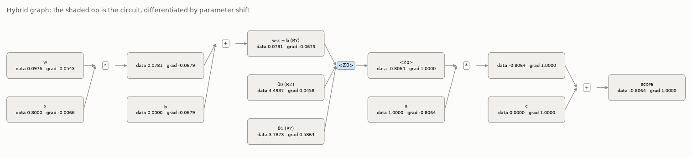
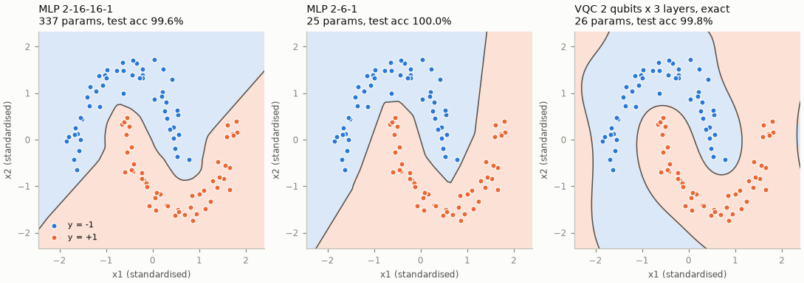
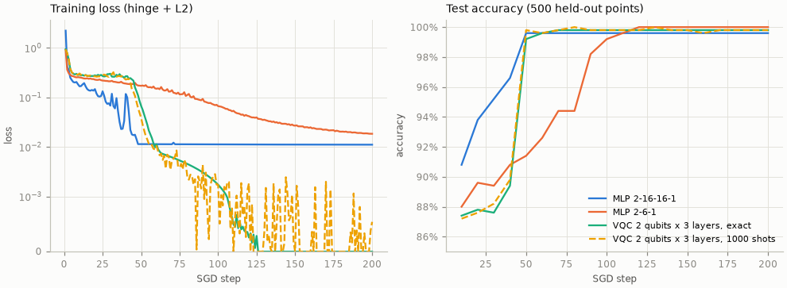
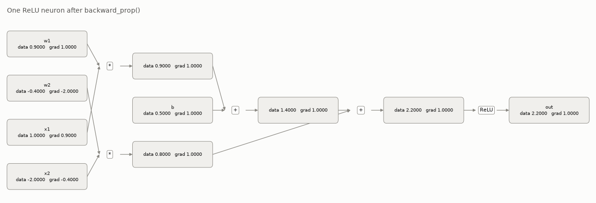

# micrograd: classical and quantum backpropagation

[](https://github.com/GabeMed/micrograd/actions/workflows/ci.yml)

A from-scratch autograd engine inspired by Andrej Karpathy's
[micrograd](https://github.com/karpathy/micrograd), extended with a quantum variational
circuit trained via the parameter-shift rule.

- `Value`: a scalar reverse-mode autograd engine (`+ * ** /`, ReLU, tanh, exp, log).
- `Neuron`, `Layer`, `NN`: a multi-layer perceptron built on `Value`, trained with SGD
  on a hinge loss.
- `neural_network.quantum`: a NumPy statevector simulator (RX, RY, RZ, CNOT, ⟨Z⟩) and
  an autograd op whose backward pass is the parameter-shift rule. Circuits are nodes
  in the same graph as the classical operations, so gradients flow through both.

The core depends only on NumPy. PyTorch and PennyLane appear only in two optional tests
that cross-check the gradients.

## How the quantum part works

`QuantumNeuron` is a two-qubit data re-uploading circuit. In each of 3 layers, every
qubit gets an encoding rotation `RY(w·x + b)` whose angle is a classical `Value`, then
two trainable rotations, then a CNOT (`python -m neural_network circuit`):

```
q0: ─RY(w·x0+b)──RZ(θ0)──RY(θ1)──●──RY(w·x0+b)──RZ(θ4)──RY(θ5)──●──RY(w·x0+b)───RZ(θ8)───RY(θ9)──●─
q1: ─RY(w·x1+b)──RZ(θ2)──RY(θ3)──X──RY(w·x1+b)──RZ(θ6)──RY(θ7)──X──RY(w·x1+b)──RZ(θ10)──RY(θ11)──X─
```

The score is `a·⟨Z₀⟩ + c`, which goes into the same hinge loss as the MLP. The model has
26 parameters: 12 encoding weights and biases, 12 rotation angles, and `a`, `c`.

**Parameter-shift rule.** Every gate is `R_P(θ) = exp(−iθP/2)` with a Pauli `P`, so
`P² = I`. The expectation `f(θ) = ⟨0|U(θ)† Z U(θ)|0⟩` is therefore
`α + β cos θⱼ + γ sin θⱼ` in each angle `θⱼ`. Taking the difference at `θⱼ ± π/2`
gives the derivative exactly:

$$\frac{\partial f}{\partial \theta_j} = \frac{f(\theta + \tfrac{\pi}{2}e_j) - f(\theta - \tfrac{\pi}{2}e_j)}{2}$$

This costs two circuit runs per angle and needs no infinitesimal step, so it stays
unbiased when `f` is estimated from a finite number of shots, as on hardware.

**Integration with `Value`.** `quantum.expval(circuit, angles)` returns ⟨Z_w⟩ as `Value`
nodes whose children are the angle `Value`s. On `backward_prop()` it simulates all
`2P` shifted circuits in one batched call, builds the Jacobian `J`, and accumulates
`angle_j.grad += J[k, j] · out_k.grad`. An angle can be any node, such as `w * x + b`,
so the chain rule carries the gradient on into the classical weights. The same `Value`
can also feed several gates.

<p align="center"></p>

## Results

`make_moons` data: 100 training points and 500 held-out test points, noise 0.1, features
standardised with the training statistics. All models share the same setup:
200 full-batch SGD steps, learning rate decayed linearly from 1.0 to 0.1, and the hinge
loss. The L2 weight is 1e-4 for the MLPs and 0 for the circuits, since rotation angles
are periodic. Each row is the mean ± std over seeds 0–4 (data and initialisation).
Times cover training only, measured on an Apple M4 laptop with Python 3.12 in a single
process. The 1000-shot model estimates every ⟨Z⟩ from 1000 samples, both in training
and at evaluation.

| Model | Params | Train acc | Test acc | Train time (s) | Circuit runs / step |
|---|---:|---:|---:|---:|---:|
| MLP 2-16-16-1 | 337 | 100.0% ± 0.0% | 99.6% ± 0.3% | 118.8 ± 7.7 | - |
| MLP 2-6-1 | 25 | 99.8% ± 0.4% | 99.4% ± 0.6% | 2.7 ± 0.0 | - |
| VQC 2 qubits x 3 layers, exact | 26 | 97.8% ± 3.9% | 97.5% ± 4.2% | 8.2 ± 0.1 | 3,700 |
| VQC 2 qubits x 3 layers, 1000 shots | 26 | 98.6% ± 2.0% | 98.6% ± 1.8% | 8.7 ± 0.0 | 3,700 |

<p align="center"></p>
<p align="center"></p>

- **No quantum advantage.** A 25-parameter MLP (2-6-1) reaches 99.4% ± 0.6% test
  accuracy, which matches or beats the 26-parameter circuit (97.5% ± 4.2%). make_moons is
  a toy problem. What this repository shows is a correct gradient that composes with
  classical nodes, not a performance claim.
- **One seed gets stuck.** Four of the five exact-circuit seeds reach 99.2–99.8% test
  accuracy. Seed 2 stalls at 90.0% train and 89.2% test accuracy,
  which accounts for most of the spread. With 1000 shots, the weakest seed is seed 3
  (95.2% test).
- **Shot noise.** Training on 1000-shot estimates, of both ⟨Z⟩ and every
  parameter-shift term, gives 98.6% ± 1.8% test accuracy. That is within seed-to-seed
  variation of the exact simulation.
- **Cost.** The circuit trains faster here (8.2 s against 118.8 s for the 337-parameter
  MLP) only because the simulator works on batched NumPy arrays, while the MLP builds
  tens of thousands of scalar Python nodes per step. Each circuit step needs
  100 × (1 + 2 × 18) = 3,700 circuit executions. On hardware, that count would set the
  cost.
- **Periodic boundary.** Inputs enter as rotation angles, so outside the data the
  circuit's decision function is periodic in each input. This shows as the wrap-around
  at the right edge of the circuit's panel.

Regenerate everything with `python -m neural_network compare --seeds 5 --out assets`,
which also writes per-seed numbers to [`assets/results.json`](assets/results.json).

## Classical engine

<p align="center"></p>

```python
from neural_network import NN, Value

x = [Value(1.0), Value(-2.0)]
model = NN(2, [16, 16, 1])        # 2 -> 16 -> 16 -> 1, ReLU hidden layers
score = model(x)
score.backward_prop()             # fills .grad on every parameter
```

```python
from neural_network.quantum import QuantumNeuron
from neural_network import train

qnn = QuantumNeuron(n_qubits=2, n_layers=3)   # optionally shots=1000
history = train(qnn, X, y, steps=200, lr=1.0, alpha=0.0)   # y in {-1, +1}
```

## Run

```bash
python -m venv .venv && source .venv/bin/activate
pip install -e ".[dev]"   # core: numpy; extras: matplotlib, scikit-learn, graphviz, pytest, ruff

python -m neural_network train vqc --plot vqc.png   # one model, one seed
python -m neural_network compare --seeds 5          # table + plots in assets/
python -m neural_network graph                      # computation-graph images
python -m neural_network circuit                    # print the circuit
```

## Test

```bash
pytest -q
pip install torch pennylane   # optional: enables the two cross-check tests
```

The tests check:

- every `Value` op, a composite expression and the full MLP loss against central finite
  differences, and against PyTorch;
- the simulator: normalisation, agreement with a dense Kronecker-product unitary,
  single-qubit expectations, the CNOT truth table, a Bell state, batching and shot
  estimates;
- the parameter-shift Jacobian against finite differences, both on raw circuits and
  through a mixed classical/quantum graph with a shared angle; that it is unbiased under
  shot noise; and that values and Jacobians match PennyLane's `default.qubit`;
- short training runs of both models, and the command-line interface.

CI runs ruff and pytest on Python 3.11 and 3.12, plus a job with the PyTorch and
PennyLane cross-checks.

## Structure

```
src/neural_network/
├── value.py            # Value: scalar autograd engine
├── network.py          # Module, Neuron, Layer, NN (MLP)
├── loss.py             # hinge loss + L2, accuracy
├── train.py            # SGD with linear learning-rate decay
├── visualize.py        # computation graph via graphviz or matplotlib
├── experiments.py      # data, model zoo, comparison, plots
├── __main__.py         # python -m neural_network ...
└── quantum/
    ├── simulator.py    # batched statevector simulator, Circuit
    ├── qnode.py        # expval(): circuit as a Value op, parameter-shift backward
    └── model.py        # QuantumNeuron (data re-uploading VQC)
tests/                  # pytest suite
assets/                 # generated plots and results
```

## References

- A. Karpathy, [micrograd](https://github.com/karpathy/micrograd): the design of
  `Value`, the MLP and the moons demo that this repository follows.
- K. Mitarai, M. Negoro, M. Kitagawa, K. Fujii, "Quantum circuit learning",
  Phys. Rev. A 98, 032309 (2018).
- M. Schuld, V. Bergholm, C. Gogolin, J. Izaac, N. Killoran, "Evaluating analytic
  gradients on quantum hardware", Phys. Rev. A 99, 032331 (2019).
- A. Pérez-Salinas, A. Cervera-Lierta, E. Gil-Fuster, J. I. Latorre, "Data re-uploading
  for a universal quantum classifier", Quantum 4, 226 (2020).
